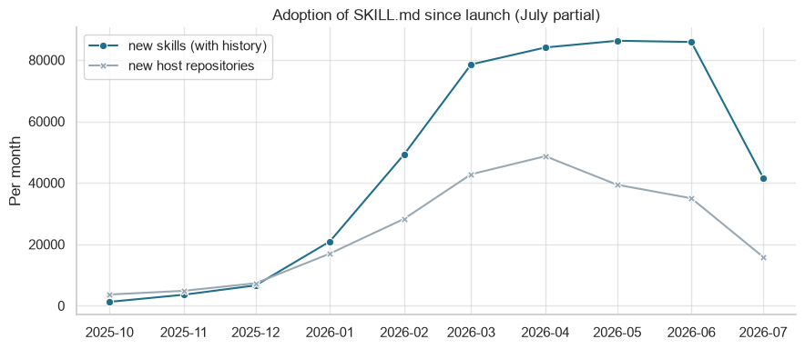
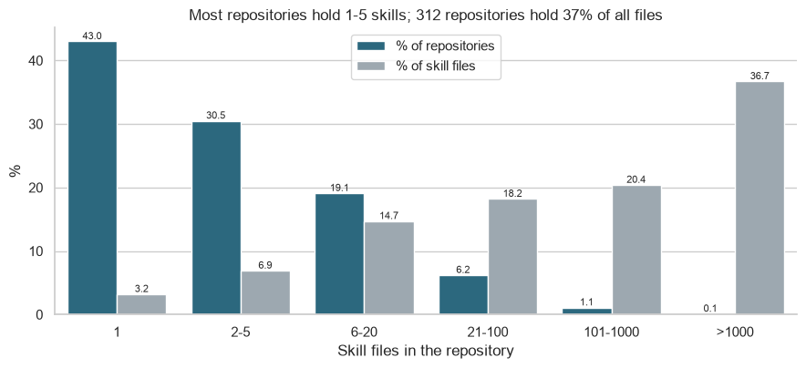
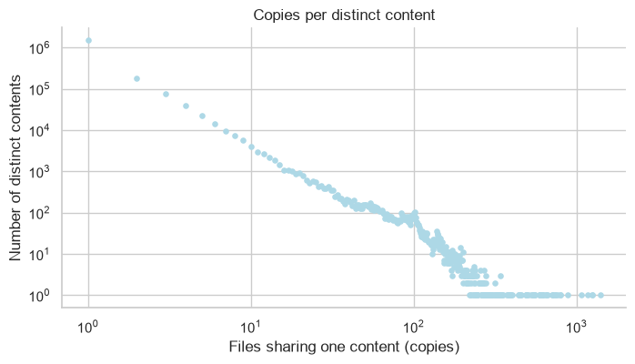
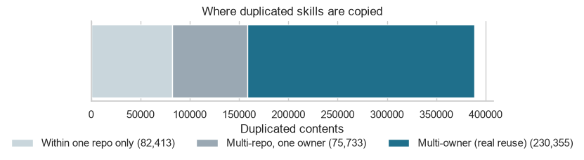
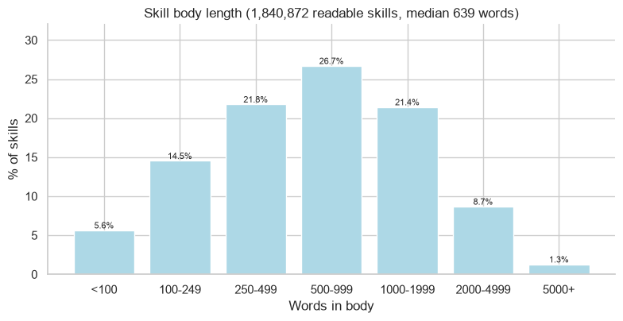
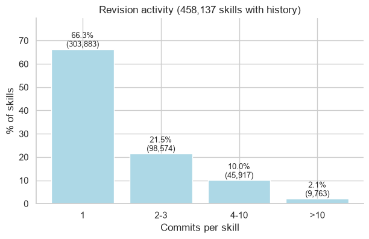
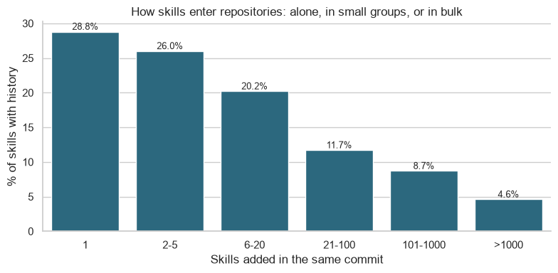
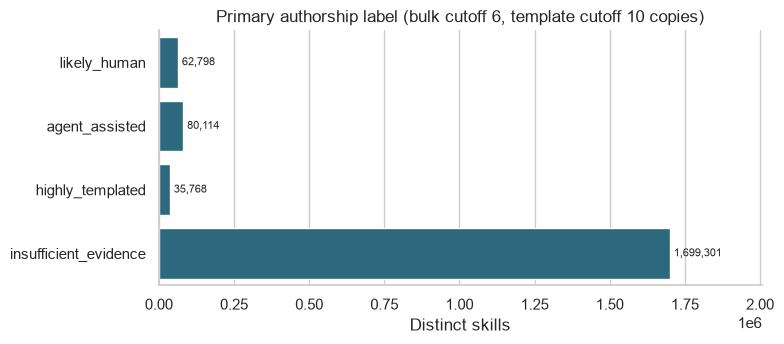
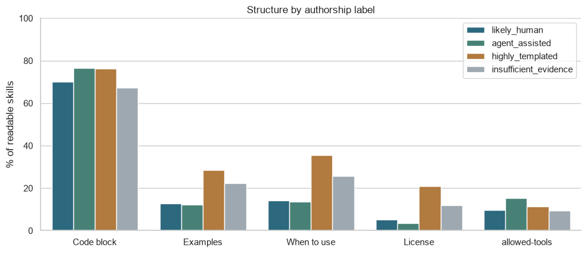

# Sprint 1 Report: Can We Tell Who Wrote a Skill?

## 1. The question in plain words

AI coding tools such as Claude Code, Cursor and Copilot now help write a lot of software. One kind of file they use is a **skill**: a `SKILL.md` text file that gives an AI agent step-by-step instructions for a task, such as "how to review code" or "how to make a PDF".

Our research question:

> Can we tell apart skills that look **human-written**, **agent-assisted**, or **highly templated** (copied from a standard template), using the file's structure, its wording, and its commit history? And how far can we trust that signal?

Why it matters: an agent follows a skill's instructions, and about one in nine skills ships scripts the agent may run. If we can say how a skill was probably made, people can judge how much to trust it.

**This sprint:** explore the data to learn what signals exist and how good they are. The wording analysis (such as how many commands a skill gives) is planned for the next phase.

## 2. The data

We use the public **GitSkills** dataset (Hugging Face: `mvaccargiu/gitskills`).

| What | Count |
|---|---:|
| `SKILL.md` files found on GitHub | 3,797,117 |
| Repositories that hold them | 282,200 |
| Accounts that own those repositories | 195,841 |
| **Distinct skills** (after removing exact copies) | **1,877,981** |
| Distinct skills that have commit history | 458,548 (24.4%) |

We count each distinct skill once (the unit of analysis), so a skill copied 500 times counts as one.

## 3. What the skill world looks like

### 3.1 The format is new and grew fast

Skills were introduced in October 2025. Most of the activity is in the months since. The last month (July 2026) is only partly collected, so its drop is not a real decline.

Most repositories are small, personal projects:
- 86.2% of repositories were created in October 2025 or later.
- 59.3% have no stars. Only 4.1% have 100 or more.
- The most common languages are Python (25.4%) and TypeScript (23.8%).

### 3.2 A few big repositories hold a huge share of the files

43% of repositories hold just one skill file. Yet a small group of very large repositories (312 of them) holds 37% of all files. Many of those are registries or mirrors that copy skills in bulk.

### 3.3 Skills are copied a lot

- 79.3% of distinct skills exist as a single file.
- But **50.5% of all files are exact copies** of a skill that exists elsewhere.
- The most copied skill appears in 1,409 files.

The chart uses log scales: most skills have one copy, and very few have hundreds.

Where do the copies live? Of the 388,501 skills that are copied at all:

| Copied... | Skills | Share |
|---|---:|---:|
| inside one repository only | 82,413 | 21.2% |
| across repositories of one owner | 75,733 | 19.5% |
| across different owners (real reuse) | 230,355 | 59.3% |

### 3.4 What a typical skill looks like

The typical skill is short: a median of **639 words**. Seven in ten have between 250 and 2,000 words.

Other facts:
- 36.3% of skills include extra files besides `SKILL.md`. 11.4% include scripts, mostly Python (63% of those) and shell.
- 13.4% have broken or invalid front matter (the header block at the top).
- Most skills are never edited after they are added: **66.3% have a single commit**.

## 4. How we label authorship

We cannot see who typed a skill, so we use clues and call the result a **heuristic label**, not a fact.

| Clue | What it tells us |
|---|---|
| Commit message says `Co-authored-by: Claude` (or Cursor, Copilot, Codex, Gemini) | An AI tool was involved in the commit |
| The commit was made by a coding-agent bot | An agent made the commit |
| Same text appears in 10 or more files | Probably a template or a widely shared skill |
| Committed alone by a person, no AI clue, text appears once | No sign of AI, "likely human" |

**Important:** 30.3% of skills with history have an AI co-author line, and 95.2% of those name Claude.

### The bulk-install problem

If someone asks an AI tool to copy 1,000 skills into a project, all 1,000 get the AI co-author line, but the AI wrote none of them. So we ignore the commit clues when 6 or more skills arrive in the same commit.

Of the 138,670 skills whose first commit names an AI tool:

| What happens to them | Skills | Share |
|---|---:|---:|
| Stay "agent-assisted" | 79,607 | 57.4% |
| Dropped as bulk installs | 53,705 | 38.7% |
| Already counted as templated | 5,242 | 3.8% |
| Made by a non-coding bot | 116 | 0.1% |

The cutoff choice matters. Agent-assisted would be 109,423 skills with a cutoff of 21, and 134,028 with no cutoff at all.

### The resulting labels

The rules are applied in order: templated first, then agent-assisted, then likely human.

| Label | Skills | Share |
|---|---:|---:|
| Likely human | 62,798 | 3.3% |
| Agent-assisted | 80,114 | 4.3% |
| Highly templated | 35,768 | 1.9% |
| Insufficient evidence | 1,699,301 | 90.5% |

Two things to keep in mind:
- "Likely human" only means we found no sign of AI. A missing AI note does not prove a person wrote it.
- 90.5% is "insufficient evidence" mostly because three out of four skills have no commit history. It does not mean a fourth kind of author.

## 5. Do the three groups look different?

### 5.1 Templated skills: yes

Highly templated skills are only 1.9% of distinct skills, but they make up **31.4% of all files** (1,192,572 files). They stand out:

| | Likely human | Agent-assisted | Highly templated |
|---|---:|---:|---:|
| Median words | 589 | 661 | 854 |
| Median headings | 10 | 11 | 18 |
| Has an "Examples" section | 12.9% | 12.3% | 28.5% |
| Has a "When to use" section | 14.1% | 13.5% | 35.5% |
| Has a `license` field | 5.2% | 3.6% | 20.8% |
| Single commit, never edited | 57.8% | 54.6% | 94.4% |
| Median skill files in its repository | 5 | 8 | 238 |
| Lives in a repository with 100+ skill files | 4.0% | 5.4% | 61.3% |

In short, templated skills are longer, more formal, rarely edited, and live inside large collections.

### 5.2 Human vs agent-assisted: barely

These two groups look almost the same on everything we measured:

| | Likely human | Agent-assisted |
|---|---:|---:|
| Mean length (characters) | 6,095 | 6,619 |
| Valid front matter | 89.4% | 89.3% |
| Mean commits | 2.69 | 2.68 |
| Has an "Examples" section | 12.9% | 12.3% |
| Includes a code block | 70.2% | 76.6% |
| Median repository size (skill files) | 5 | 8 |
| Zero-star repository | 49.3% | 52.2% |

The small differences mostly come from **where the skill is stored**. 71.8% of agent-assisted skills sit in a standard agent folder, against 42.8% of likely-human skills. Inside those folders, the two groups match almost exactly (median 694 vs 736 words).

Commit messages show one gap: 19.6% of agent-assisted skills have "install / sync / import" wording, against 8.7% for likely human. That is again the install effect.

### 5.3 Repository clues

| | Likely human | Agent-assisted | Highly templated |
|---|---:|---:|---:|
| Repository created before 2025 | 15.3% | 9.0% | 4.5% |
| Skill is under `.claude/` | 43.0% | 72.0% | 57.7% |
| Only skill file in its repository | 22.8% | 10.7% | 1.4% |

The `.claude/` number is partly circular. Claude Code both stores skills in `.claude/` and adds the co-author line our label reads.

## 6. Other findings that affect later work

- **Names are not identities.** The same front-matter `name` is used by many different texts. For example, `skill-creator` covers 2,765 different texts. We use the text hash, not the name.
- **Exact-copy removal misses some copies.** After ignoring case and spacing, 198,374 more skills turn out to be copies. In a 20,000-skill sample, 12.1% have a near-twin (similarity of 0.8 or higher), and most twins belong to the same owner.
- **Bots are rare as authors.** Only 4,630 skills were first committed by a bot. Of those, 65% came from `github-actions[bot]`, which syncs or publishes files and does not write them.

## 7. What this means for the research question

| Part of the question | Where we stand |
|---|---|
| Can we spot **highly templated** skills? | **Yes.** They differ clearly on copy count, structure, repository size and edit history. |
| Can we spot **agent-assisted** skills? | **Partly.** The commit co-author line is the one clear signal. Text and structure add little on their own. |
| Can we spot **human-written** skills? | **Weak.** We can only say "no sign of AI". |
| How reliable is the signal? | **Not measured yet.** We have no ground truth to check the labels against. |

Competing explanations we must rule out (listed in `RESEARCH_QUESTION.md`):
1. The label may just reflect **where** a skill is stored (tool folder).
2. "Highly templated" may be only a **copy count**.
3. The AI note may record **who ran an install**, not who wrote the text.
4. Differences may reflect **when** a repository adopted skills.
5. There may be **no real text signal** for human vs agent.

## 8. Limits to keep in mind

- Commit history exists for only 24.4% of skills, so most skills cannot get a commit-based label.
- Labels are rules we chose, not verified facts. The cutoffs (6 files in a batch, 10 copies) are judgment calls.
- Commit history describes the one chosen copy of a skill, which may sit in a different repository from the one that wrote it.
- Skills from early adopters and Claude Code users are over-represented in the history-backed group.
- The data covers public repositories only and is a lower bound.

## 9. Next steps (Phase 2)

1. **Wording features.** Measure command-style language, tone and typical AI phrasing, for all skills including the 76% with no history.
2. **Hand-label a sample** of about 200-300 skills so we can measure how often the labels are right.
3. **Test the simple explanations.** Check whether the full method beats simple baselines: folder alone, copy count alone, AI note alone.
4. **Check the cutoffs.** Show how the labels change when the batch and copy thresholds move.
5. **Write `THREATS_TO_VALIDITY.md`** with the limits above.

## 10. Where to find things

| Item | Location |
|---|---|
| Research question | `RESEARCH_QUESTION.md` |
| Data description | `DATA_DICTIONARY.md` |
| Analysis notebooks | `src/notebooks/` (`EDA_authorship`, `EDA_content`, `EDA_copies`, `EDA_repos`, and others) |
| SQL that builds the data files | `db/` |
| Charts used here | `figures/` |
